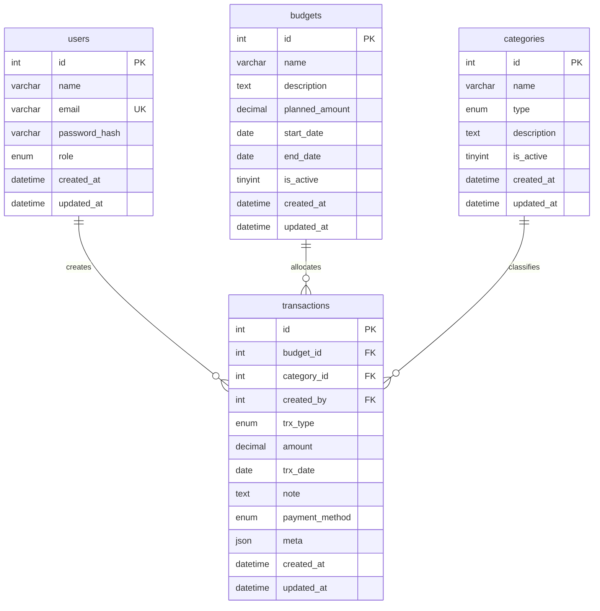

# Entity Relationship Diagram (ERD)

## Relasi Utama
- **users → transactions**: satu user dapat membuat banyak transaksi (opsional, karena transaksi bisa dibuat sistem).
- **budgets → transactions**: setiap transaksi wajib dikaitkan dengan satu budget aktif.
- **categories → transactions**: kategori menentukan tipe transaksi (income/expense/both).

Gunakan diagram ini saat menyusun dokumentasi atau laporan akhir; cukup salin blok Mermaid ke Doc/Notion/VS Code yang mendukung render Mermaid untuk menampilkan diagram visual.
