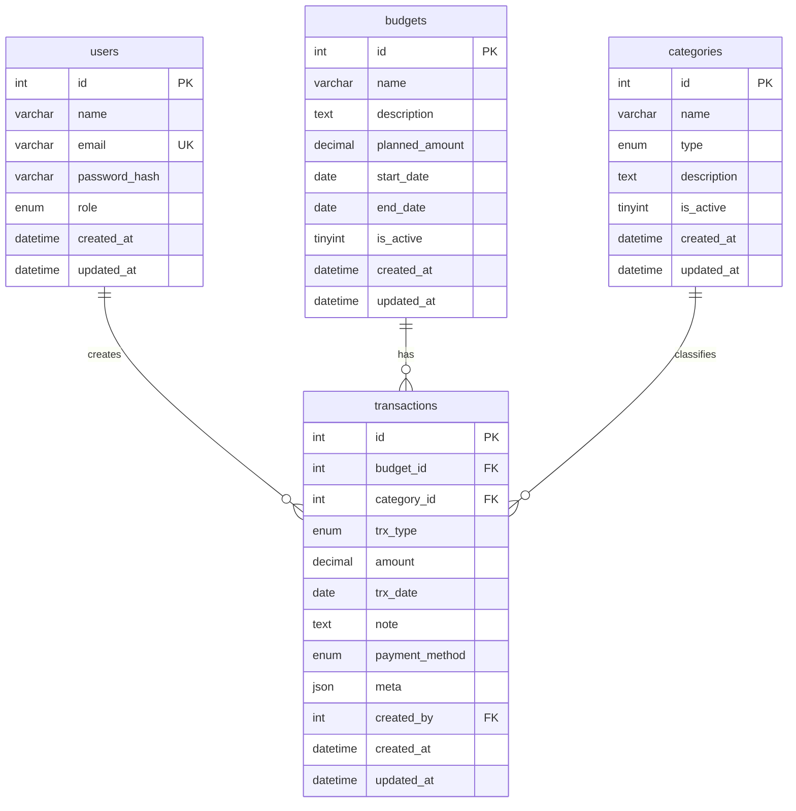

# 💰 Kas Organisasi - Aplikasi Manajemen Keuangan

**UAS Fullstack Web Modern - Sistem Informasi**

Aplikasi manajemen keuangan organisasi dengan fitur pengelompokan dana berdasarkan **Budgets** (pos anggaran) dan **Categories** (kategori penggunaan). Transaksi memiliki kolom JSON `meta` yang memberikan fleksibilitas penyimpanan data tambahan ala NoSQL.

---

## 📋 Deskripsi Project

Kas Organisasi adalah aplikasi web fullstack untuk mengelola keuangan organisasi dengan fitur:
- ✅ Manajemen Budgets (Anggaran/Proker/Event)
- ✅ Manajemen Categories (Kategori Income/Expense)
- ✅ Transaksi Keuangan (Income & Expense) dengan meta JSON
- ✅ Dashboard Summary dengan statistik real-time
- ✅ Authentication & Authorization (JWT)
- ✅ REST API dengan validasi lengkap
- ✅ Protected Routes di Frontend

---

## 🛠️ Tech Stack

### Backend
- **Node.js** + **Express.js** (MVC Pattern)
- **MySQL** (Database) dengan **mysql2/promise**
- **JWT** (Authentication)
- **bcrypt** (Password Hashing)
- **dotenv** (Environment Variables)
- **CORS** (Cross-Origin Resource Sharing)

### Frontend
- **Vue 3** (Composition API)
- **Vue Router** (Navigation & Protected Routes)
- **Axios** (HTTP Client dengan Interceptor)
- **Vite** (Build Tool)

---

## 📊 ERD (Entity Relationship Diagram)



**Relasi:**
- **users ↔ transactions** (1:N) - User dapat membuat banyak transaksi
- **budgets ↔ transactions** (1:N) ⭐ WAJIB - Budget memiliki banyak transaksi
- **categories ↔ transactions** (1:N) ⭐ WAJIB - Category digunakan di banyak transaksi

---

## 🚀 Cara Menjalankan Project

### Prerequisites
- Node.js (v16 atau lebih baru)
- MySQL (v8 atau lebih baru)
- Git

### 1. Clone Repository
```bash
git clone https://github.com/danJidan/Sistem-Kas-Organisasi.git
cd Sistem-Kas-Organisasi
```

### 2. Setup Database

1. **Buat Database:**
```sql
CREATE DATABASE kas_organisasi CHARACTER SET utf8mb4 COLLATE utf8mb4_unicode_ci;
```

2. **Jalankan DDL:**
```bash
mysql -u root -p kas_organisasi < database_ddl.sql
```

3. **Jalankan Seed Data:**
```bash
mysql -u root -p kas_organisasi < database_seed.sql
```

**Catatan:** Seed data memiliki password placeholder. Untuk testing, gunakan endpoint `/auth/register` untuk membuat user baru, atau update manual password hash dengan bcrypt.

**Demo Users (setelah seed manual):**
- Admin: `admin@demo.com` / `Admin123!`
- Member: `member@demo.com` / `Member123!`

### 3. Setup Backend

```bash
cd backend

# Install dependencies
npm install

# Copy environment file
copy .env.example .env

# Edit .env sesuai konfigurasi database Anda
# DB_HOST=localhost
# DB_USER=root
# DB_PASSWORD=your_password
# DB_NAME=kas_organisasi

# Run development server
npm run dev
```

Backend akan berjalan di: `http://localhost:5000`

### 4. Setup Frontend

```bash
cd frontend

# Install dependencies
npm install

# Run development server
npm run dev
```

Frontend akan berjalan di: `http://localhost:5173`

### 5. Testing

1. **Buka browser:** `http://localhost:5173`
2. **Login** dengan kredensial demo
3. **Explore:**
   - Dashboard: Lihat summary keuangan
   - Budgets: CRUD budgets
   - Categories: CRUD categories
   - Transactions: CRUD transactions dengan form lengkap

---

## 📁 Struktur Project

```
UASIN/
├── backend/
│   ├── config/
│   │   └── database.js          # MySQL connection pool
│   ├── controllers/
│   │   ├── authController.js    # Login, Register, Profile
│   │   ├── budgetController.js  # CRUD Budgets
│   │   ├── categoryController.js # CRUD Categories
│   │   ├── transactionController.js # CRUD Transactions
│   │   └── summaryController.js # Summary endpoints
│   ├── middleware/
│   │   ├── auth.js              # JWT verification
│   │   ├── validate.js          # Input validation
│   │   └── errorHandler.js      # Global error handler
│   ├── models/
│   │   ├── User.js
│   │   ├── Budget.js
│   │   ├── Category.js
│   │   └── Transaction.js
│   ├── routes/
│   │   ├── authRoutes.js
│   │   ├── budgetRoutes.js
│   │   ├── categoryRoutes.js
│   │   ├── transactionRoutes.js
│   │   └── summaryRoutes.js
│   ├── utils/
│   │   └── responseHelper.js    # Consistent API response
│   ├── .env                      # Environment variables
│   ├── .env.example
│   ├── package.json
│   └── server.js                 # Entry point
│
├── frontend/
│   ├── src/
│   │   ├── api/
│   │   │   └── axios.js         # Axios instance + interceptor
│   │   ├── components/
│   │   │   └── Navbar.vue
│   │   ├── router/
│   │   │   └── index.js         # Vue Router + guards
│   │   ├── views/
│   │   │   ├── Login.vue
│   │   │   ├── Dashboard.vue
│   │   │   ├── Budgets.vue
│   │   │   ├── Categories.vue
│   │   │   ├── Transactions.vue
│   │   │   ├── TransactionForm.vue
│   │   │   └── TransactionDetail.vue
│   │   ├── App.vue
│   │   └── main.js
│   ├── .env
│   ├── index.html
│   ├── package.json
│   └── vite.config.js
│
├── screenshots/               # Folder untuk screenshot testing
├── database_ddl.sql          # Schema SQL
├── database_seed.sql         # Data awal
├── DATABASE.md               # Dokumentasi database
├── API_ENDPOINTS.md          # Dokumentasi API lengkap
└── README.md                 # File ini
```

---

## 🔐 Authentication Flow

1. **User Login:** POST `/auth/login` dengan email & password
2. **Receive Token:** Backend return JWT token
3. **Save Token:** Frontend simpan token di `localStorage`
4. **Attach Token:** Setiap request ke protected endpoint, attach token di header:
   ```
   Authorization: Bearer <token>
   ```
5. **Auto Logout:** Jika token invalid/expired (401), redirect ke `/login`

---

## 📝 Daftar Endpoint API

Lihat dokumentasi lengkap di [API_ENDPOINTS.md](API_ENDPOINTS.md)

### Summary Endpoints:
1. **Authentication:** Register, Login, Get Profile
2. **Budgets:** GET, POST, PUT, DELETE
3. **Categories:** GET, POST, PUT, DELETE
4. **Transactions:** GET (paginated), POST, PUT, DELETE
5. **Summary:** Overall, By Budget, By Category, By Date

**Total Endpoints:** 22 endpoints

---

## ✅ Checklist Ketentuan UAS

| No | Ketentuan | Status |
|----|-----------|--------|
| 1 | REST API CRUD Express.js + MySQL | ✅ |
| 2 | Struktur folder backend MVC | ✅ |
| 3 | JWT Authentication | ✅ |
| 4 | Middleware validate | ✅ |
| 5 | Middleware auth | ✅ |
| 6 | Middleware errorHandler | ✅ |
| 7 | Minimal 2 tabel relasi (budgets, categories → transactions) | ✅ |
| 8 | Setiap tabel minimal 6 kolom | ✅ |
| 9 | Ada kolom angka (planned_amount, amount) | ✅ |
| 10 | Ada kolom tanggal (start_date, end_date, trx_date) | ✅ |
| 11 | Frontend minimal 5 halaman | ✅ (7 halaman) |
| 12 | Protected route di frontend | ✅ |
| 13 | Query agregasi SQL (SUM, COUNT, CASE) | ✅ |
| 14 | Validasi foreign key | ✅ |
| 15 | Response JSON konsisten | ✅ |

---

## 📸 Screenshots Testing Checklist

Ambil screenshot untuk dokumentasi UAS:

### Authentication (3 screenshots)
- [x] Login sukses dengan token
- [x] Login gagal (email/password salah)
- [x] Protected route tanpa token (401 redirect)

### Budgets (4 screenshots)
- [x] GET /budgets - List semua budgets
- [x] POST /budgets - Create budget baru
- [x] PUT /budgets/:id - Update budget
- [x] DELETE /budgets/:id - Delete budget

### Categories (4 screenshots)
- [x] GET /categories - List categories
- [x] POST /categories - Create category
- [x] PUT /categories/:id - Update category
- [x] DELETE /categories/:id - Delete category

### Transactions (5 screenshots)
- [x] GET /transactions - List dengan pagination
- [x] GET /transactions/:id - Detail transaction
- [x] POST /transactions - Create transaction
- [x] PUT /transactions/:id - Update transaction
- [x] DELETE /transactions/:id - Delete transaction

### Summary (3 screenshots)
- [x] GET /summary - Overall summary
- [x] GET /summary/by-budget - Summary per budget
- [x] GET /summary/by-category - Summary per category

**Total: 19 screenshots minimum**

Simpan semua screenshot di folder `/screenshots` dengan nama yang jelas (misal: `01-login-success.png`)

---

## 🧪 Testing dengan Postman/Thunder Client

### Setup Collection

1. **Create New Collection:** "Kas Organisasi API"
2. **Set Base URL:** `http://localhost:5000`
3. **Create Folder Structure:**
   - Auth
   - Budgets
   - Categories
   - Transactions
   - Summary

### Testing Flow

1. **Register (Optional):**
   ```
   POST /auth/register
   Body: { "name": "Test User", "email": "test@test.com", "password": "Test123!", "role": "member" }
   ```

2. **Login:**
   ```
   POST /auth/login
   Body: { "email": "admin@demo.com", "password": "Admin123!" }
   → Save token from response
   ```

3. **Set Authorization:**
   - Type: Bearer Token
   - Token: <paste token dari login>

4. **Test All Endpoints** sesuai urutan:
   - Budgets (GET, POST, PUT, DELETE)
   - Categories (GET, POST, PUT, DELETE)
   - Transactions (GET, POST, PUT, DELETE)
   - Summary (4 endpoints)

5. **Test Validation:**
   - Create transaction dengan amount = 0 (should fail)
   - Create transaction dengan budget_id tidak exist (should fail)
   - Create transaction dengan trx_type tidak match category.type (should fail)
   - Create transaction dengan meta JSON invalid (should fail)

---

## 🎯 Business Rules yang Diimplementasikan

### Budgets
- `planned_amount` >= 0
- `start_date` <= `end_date`
- Tidak bisa delete jika masih ada transaction (FK constraint)

### Categories
- `type` harus: income, expense, atau both
- Tidak bisa delete jika masih digunakan transaction

### Transactions
- `amount` > 0 (wajib positif)
- `budget_id` harus exist di tabel budgets
- `category_id` harus exist di tabel categories
- **Rule Khusus:** Jika `trx_type=income`, category.type harus `income` atau `both`
- **Rule Khusus:** Jika `trx_type=expense`, category.type harus `expense` atau `both`
- `meta` harus valid JSON jika diisi

---

## 🌟 Fitur Unggulan

1. **Meta JSON Field:**
   - Kolom `transactions.meta` berisi data fleksibel NoSQL
   - Contoh: `{"receipt_url": "...", "pic_name": "...", "location": "..."}`
   - Bisa store data berbeda untuk setiap transaksi

2. **Query Agregasi SQL:**
   - Summary menggunakan `SUM()` + `CASE WHEN`
   - Query by budget, category, dan date range
   - Pagination pada list transactions

3. **Validasi Berlapis:**
   - Middleware validate (tipe data, required, format)
   - Controller validate (business rules)
   - Database validate (FK constraint, CHECK constraint)

4. **Protected Routes:**
   - Frontend: Route guard redirect ke login
   - Backend: Middleware auth cek JWT
   - Auto logout jika token expired

5. **Error Handling:**
   - Global error handler
   - Response format konsisten
   - User-friendly error messages

---

## 📦 Dependencies

### Backend
```json
{
  "express": "^4.18.2",
  "mysql2": "^3.6.5",
  "bcrypt": "^5.1.1",
  "jsonwebtoken": "^9.0.2",
  "dotenv": "^16.3.1",
  "cors": "^2.8.5"
}
```

### Frontend
```json
{
  "vue": "^3.3.11",
  "vue-router": "^4.2.5",
  "axios": "^1.6.2"
}
```

---

## 🐛 Troubleshooting

### Backend tidak bisa connect ke database
- Pastikan MySQL service running
- Check kredensial di `.env`
- Test connection: `mysql -u root -p`

### Frontend tidak bisa hit API (CORS error)
- Check `ALLOWED_ORIGINS` di backend `.env`
- Pastikan frontend URL ada di list

### Token expired terus
- Check `JWT_EXPIRES_IN` di `.env`
- Default: 7 hari
- Bisa diubah misal: `1h`, `30d`

### Error "Cannot DELETE ... referenced by other table"
- Ini FK constraint bekerja dengan benar
- Hapus child records (transactions) dulu sebelum hapus parent (budget/category)

---

## 👨‍💻 Developer Notes

### Cara Menambah Endpoint Baru

1. **Model:** Buat query di `models/NamaModel.js`
2. **Controller:** Buat handler di `controllers/namaController.js`
3. **Route:** Daftarkan di `routes/namaRoutes.js` dengan validation
4. **Import:** Tambahkan route di `server.js`

### Cara Menambah Halaman Frontend

1. **View:** Buat component di `src/views/NamaView.vue`
2. **Route:** Daftarkan di `src/router/index.js`
3. **Navbar:** Tambahkan link di `components/Navbar.vue`

---

## 📄 License

Project ini dibuat untuk keperluan UAS Fullstack Web.

---

## 🙏 Credits

- **Stack:** Node.js, Express.js, MySQL, Vue 3, Vite
- **Author:** [Muhammad Zidan Azzaki & M. Aryan Faturrahman]
- **NIM:** [F1d022080 & F1D022069]
